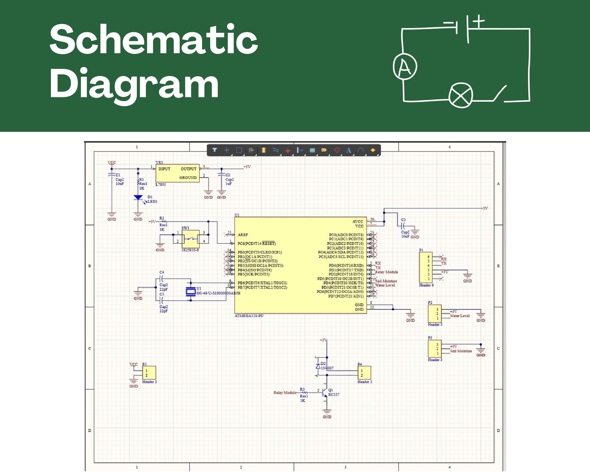
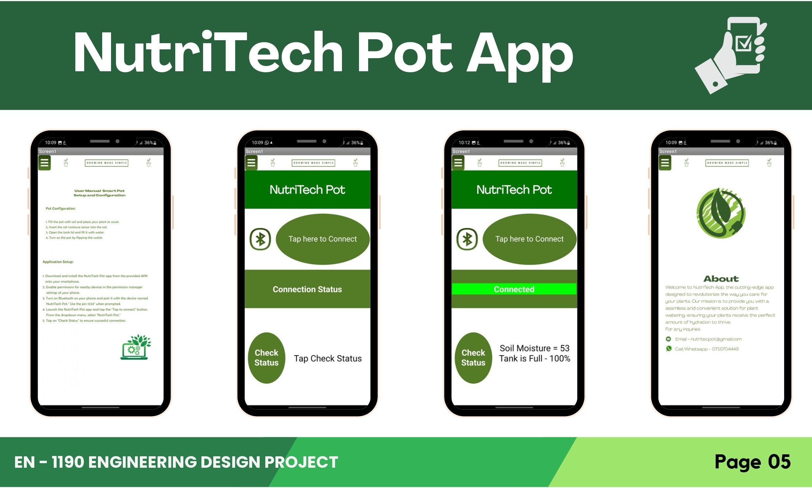
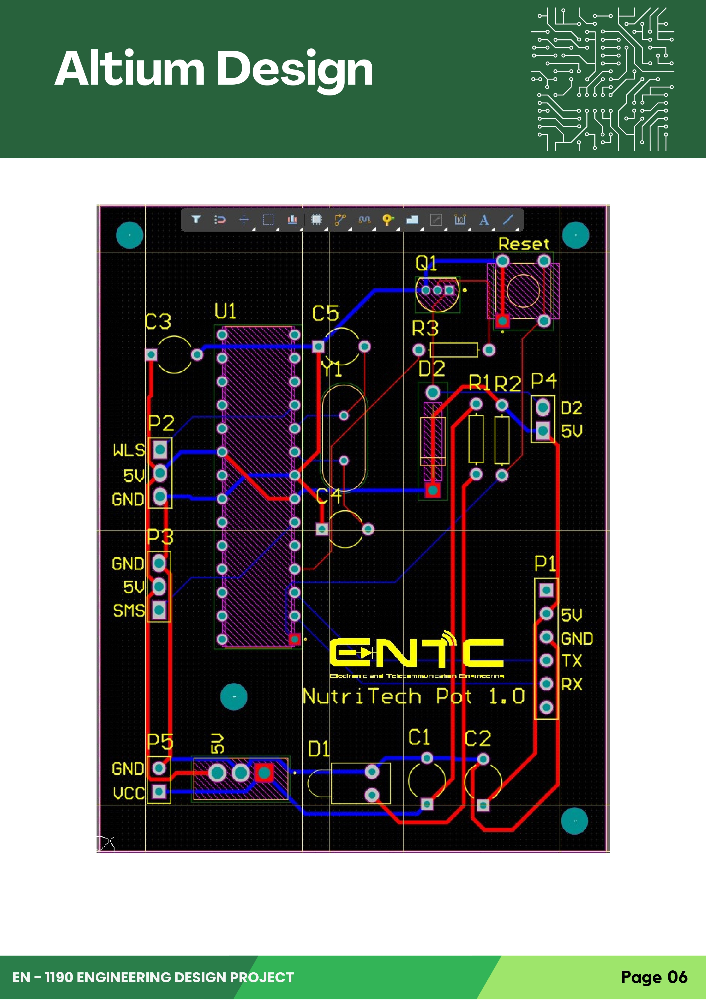
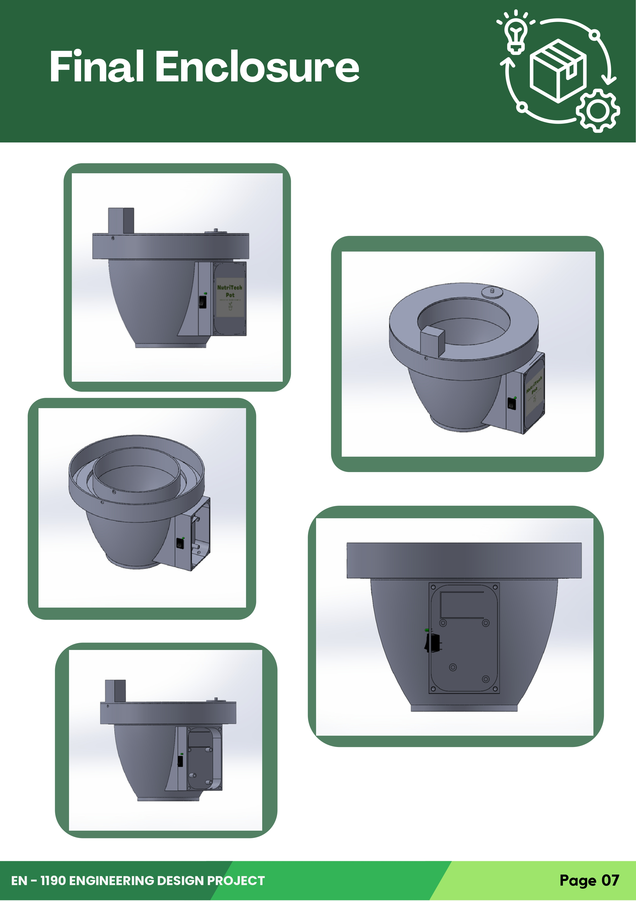

# NutriTechPot

**EN - 1190 ENGINEERING DESIGN PROJECT**

---

## Table of Contents
1. [Problem Description and Motivation](#problem-description-and-motivation)
2. [Product Idea Validation](#product-idea-validation)
3. [Technical Feasibility](#technical-feasibility)
4. [Product Architecture](#product-architecture)
5. [Changes We Made](#changes-we-made)
6. [Designs](#designs)
7. [Marketing and Sales](#marketing-and-sales)
8. [Future Improvements](#future-improvements)
9. [Power Consumption and Battery Life](#power-consumption-and-battery-life)
10. [Project Budget](#project-budget)
11. [Contact](#contact)

---

## Problem Description and Motivation

### Problem Description
Many people struggle with keeping their plants alive due to inconsistent watering and inadequate sunlight. For busy individuals or those without a green thumb, this can be a frustrating and costly problem. Our project aims to address this issue by creating a smart plant pot that automatically waters plants when the soil moisture level is low to ensure optimal growing conditions. By providing a solution to this common problem, we hope to make plant care more accessible and enjoyable for everyone.

### Motivation
The motivation for selecting the smart plant pot project was driven by the growing trend of agriculture-based products in the world. With an increasing focus on sustainability and healthy living, more people are turning to plant care as a way to connect with nature and improve their indoor air quality. By creating a smart plant pot that automates watering, we aim to make plant care more accessible and enjoyable for everyone. Furthermore, with the rising interest in smart home technology, we believe that our product has the potential to tap into a large and growing market.

---

## Product Idea Validation
We conducted a survey among a randomly selected group of about 50 people to validate the product idea for our smart plant pot. The survey revealed that a majority of participants struggled with plant care due to inconsistent watering and providing fertilization. Most people stated that they liked gardening but didn't have enough time to look after plants, and they often forgot to water them. Over 70% of respondents expressed interest in using a smart plant pot that automatically waters their plants. Participants also identified features such as automatic watering and real-time monitoring as desirable in a smart plant pot. Based on the survey results, we believe that our smart plant pot has promising market potential and addresses a common pain point among plant enthusiasts.

---

## Technical Feasibility
The product is designed to automatically water plants when the soil moisture level is low for optimal plant growth. To achieve this, we will use hardware components such as the Atmega328p microcontroller, capacitive soil moisture sensor, DC water pump, and a water level detector. All necessary components are readily available. Software requirements include the Arduino IDE for programming the microcontroller, Android Studio for app development, Altium Designer for PCB design, and Solidworks for enclosure design. We plan to hire professionals for PCB printing and 3D printing. The necessary resources, including soldering equipment, are available.

---

## Product Architecture

- **Power Supply**
- **Soil Moisture Sensor**
- **Atmega 328p Microcontroller**
- **DC Water Pump**
- **Water Level Sensor**
- **Bluetooth Module**
- **NutriTech App**

The NutriTech application tracks the water level in the tank, alerts the user when a refill is needed, and constantly monitors the soil moisture level, presenting the data in an easily understandable format to the user.

---

## Changes We Made
Initially, we planned to use a Wi-Fi module (ESP 8266) for communication between the chip and the NutriTech Pot application. However, we encountered significant challenges with this approach, such as needing to modify the code every time the pot was moved to a different Wi-Fi network. We switched to using a Bluetooth module (HC-05), which offers higher accuracy and a more user-friendly experience. This change enhanced the overall functionality and user experience of the NutriTech Pot application.

---

## Designs

### Schematic Diagram

### NutriTech Pot App

### Altium Design

### Final Enclosure

---

## Marketing and Sales

### Competitive Forces
The market is new and growing, with evolving competition. Product quality, pricing, support, and marketing affect competitive forces. Intensified competition and tech advancements require staying ahead.

### Marketing Strategies
- **Social Media Marketing**
- **Influencer Marketing**
- **Email Marketing**
- **Content Marketing**

### Target Markets
Our project targets people who care about gardening and sustainability, especially those living in urban areas with limited outdoor space or who are too busy to take care of plants manually. We plan to market the product to them by emphasizing its convenience and benefits.

### Product Packaging
The product packaging will be made of recycled materials and have eco-friendly messaging and imagery. It will also be sturdy and protective to keep the product safe during transport.

### Warranty Terms
We offer a 6-month warranty period with a 10-month service period for the smart watering and fertilizing pot, covering any defects in materials or workmanship. The warranty period is clearly communicated to customers, and any necessary steps for claiming warranty are made easily accessible.

### After Sales Service
We provide clear instructions for cleaning and upkeep to ensure the product lasts for a long time. Additionally, we offer repair services for any damages or malfunctions that occur during the warranty and service period.

### Reuse/Recycle and Disposal
We encourage customers to reuse and recycle the product when it is no longer needed. The product is designed to be easily disassembled and recyclable at the end of its life cycle. We also plan to offer recycling programs or incentives for customers who choose to recycle the product.

### Sales Channels
- **Online Marketplaces:** Daraz, Ikman.lk, eBay
- **E-Commerce Website**
- **Retail Stores:** Collaborations with retail stores

---

## Future Improvements

### Bottlenecks of the Initial Plan
We initially powered the circuit using a 9V battery with a voltage regulator (L7805). However, the motor's high power draw caused the circuit to power down intermittently.

### Solution
We implemented two separate voltage regulators (L7805) – one for the Atmega chip's power supply and another for the DC water pump. We replaced the 9V battery with two rechargeable Li-ion batteries (3.7V Li-Fe 18650) for improved performance and stability. This ensured a consistent power supply to both the chip and the motor.

---

## Power Consumption and Battery Life
Through testing with a DC power supply, we measured the circuit's current draw when the motor was on at 160-170 mA and when the motor was off at 68-75 mA. We calculated an approximate power consumption of 1730mAh, providing nearly two and a half days of battery life on a single recharge. We used two rechargeable Li-ion batteries (3.7V Li-Fe 18650) connected in series due to the rapid discharge of the 9V battery.

---

## Project Budget

| Component                          | Qty | Unit Price (LKR) | Total Price (LKR) |
| ---------------------------------- | --- | ---------------- | ----------------- |
| Atmega328p Microcontroller         | 1   | 1400.00          | 1400.00           |
| Capacitive Soil Moisture sensor    | 1   | 400.00           | 400.00            |
| HC-05 Bluetooth Module             | 1   | 1100.00          | 1100.00           |
| DC Water Pump                      | 1   | 380.00           | 380.00            |
| Li-ion batteries (3.7V Li-Fe 18650)| 2   | 600.00           | 1200.00           |
| Water Level Detector               | 1   | 110.00           | 110.00            |
| 16MHz Crystal Oscillator           | 1   | 40.00            | 40.00             |
| Resistors (1 kOhm - 1, 10 kOhm - 1)| 2   | 3.00             | 6.00              |
| BC 337 npn Transistor              | 1   | 5.00             | 5.00              |
| IN 4007 Diode                      | 1   | 5.00             | 5.00              |
| Push Button Switch                 | 1   | 30.00            | 30.00             |
| Voltage Regulator                  | 2   | 50.00            | 100.00            |
| Capacitors                         | 5   | 5.00             | 25.00             |
| Connectors                         | 6   | 20.00            | 120.00            |
| LED                                | 2   | 15.00            | 30.00             |
| **Total**                          |     |                  | **4951.00**       |

### Total Production Cost
- Rs 3000 (For multiple product manufacturing)
- PCB Printing and 3D Printing - Rs 200 (per unit)
- Market Price - Rs 3600
- Manufacturing Quantities - 50 units

---
## Contact

For more information about the NutriTech Pot, contact us:

- Email: uvindukodikara@gmail.com
---
